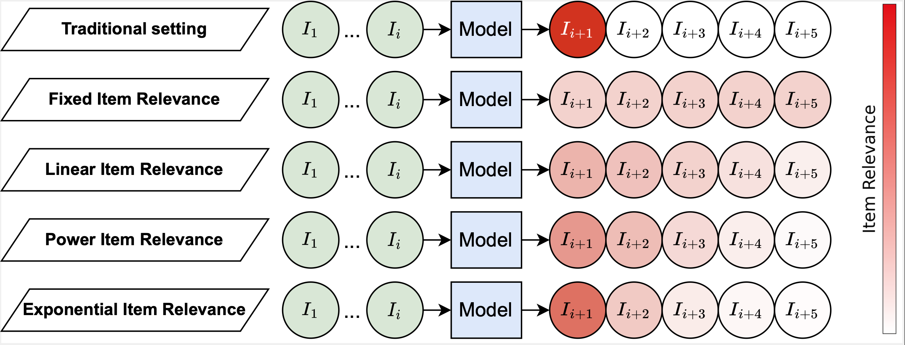

# Integrating Item Relevance in Training Loss for Sequential Recommender Systems


## Abstract
Sequential Recommender Systems (SRSs) are a popular type of recommender system that learns from a user's history to predict the next item they are likely to interact with. However, user interactions can be affected by noise stemming from account sharing, inconsistent preferences, or accidental clicks. To address this issue, we (i) propose a new evaluation protocol that takes multiple future items into account and (ii) introduce a novel relevance-aware loss function to train a SRS with multiple future items to make it more robust to noise. Our relevance-aware models obtain an improvement of ~1.2% of NDCG@10 and 0.88% in the traditional evaluation protocol, while in the new evaluation protocol, the improvement is ~1.63% of NDCG@10 and ~1.5% of HR w.r.t the best performing models.


## Cite us
```bibtex
@article{bacciu2023integrating,
  title={Integrating Item Relevance in Training Loss for Sequential Recommender Systems},
  author={Bacciu, Andrea and Siciliano, Federico and Tonellotto, Nicola and Silvestri, Fabrizio},
  journal={arXiv preprint arXiv:2305.10824},
  year={2023}
}
```

# Usage
## Data Preparation
Put your dataset in the folder data/raw/
Then you can specify the desired parameters inside the file src/data_creation.py and then you can run it:
```sh
python3 src/data_creation.py
```
## Training
To train the model you can run the following command:
```sh
python3 src/sasrec_main.py --experiment_id ${experiment_id} --train_num_positives ${train_num_positives} --train_num_negatives ${train_num_positives} --device ${device} --loss_type ${loss_type}
```
To reproduce our experiments use the bash files in the folder scripts.


### Requirements
PyTorch 2.0.0


# License
This repository contains the code of the paper. 
Part of the code from adapted the [Pytorch SASRec implementation](https://github.com/pmixer/SASRec.pytorch/).


